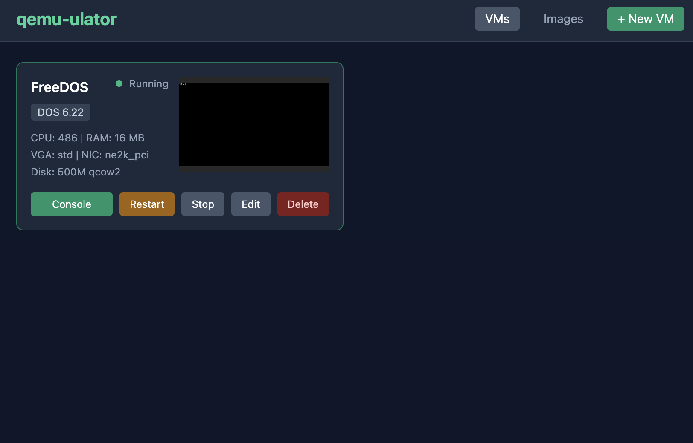

# qemulator

A self-contained QEMU instance manager with a Go backend and React frontend, focused on retro computing.




## Security

There is no authentication. Anyone with access to the HTTP port can manage VMs, images, and the host filesystem. The server binds to `127.0.0.1` by default; use `--bind` deliberately if you expose it, and do not expose the server to untrusted networks.

## Quality

This project is almost entirely vibe-coded with zero code review for correctness, soundless of implementation, security etc... Use it how you will with that context in mind.


## Features

- Create, configure, start, stop, and reset VMs from a web UI
- Manage a library of disk images and ISOs
- Preset profiles for common retro systems (DOS, Win3.1, Win95, etc.)
- Live VM display in the browser via noVNC
- Single-binary distribution with embedded frontend

## Requirements

- Go 1.26+
- Node.js (for building the frontend)
- QEMU installed and available on your `PATH`

## Building

```sh
make build    # builds web UI then Go binary
```

## Running

```sh
./qemulator
```

Common flags:

- `--bind` — HTTP server bind address (default: `127.0.0.1`)
- `--port` — HTTP server port (default: `8080`)
- `--data-dir` — data directory (default: `~/.qemulator/`)

## Development

```sh
make dev      # runs Go server and Vite dev server
make fmt      # format Go and frontend code
make lint     # go vet + tsc --noEmit
make test     # go test
make clean    # remove build artifacts
```

## Data Layout

```
~/.qemulator/
├── config.json          # App config
├── vms/                 # VM config files
├── images/              # Managed disk images
└── iso/                 # ISO storage
```

## Project Structure

```
cmd/qemulator/   # Entry point, CLI flags
internal/
  api/             # REST API, SSE, VNC proxy
  config/          # App and VM config structs
  images/          # Image library management
  qemu/            # QEMU process management, command building, presets
web/               # React frontend (built and embedded via go:embed)
```
